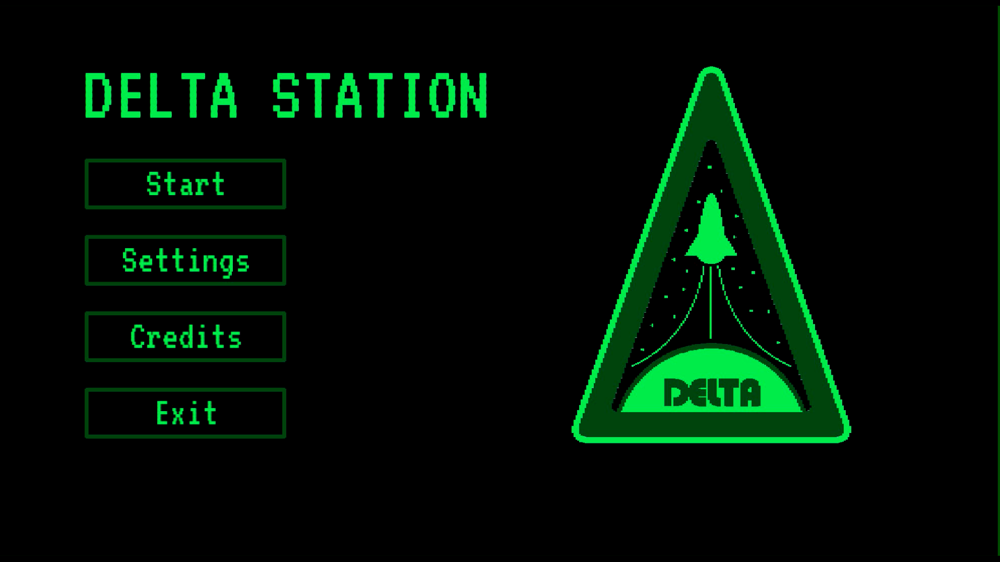
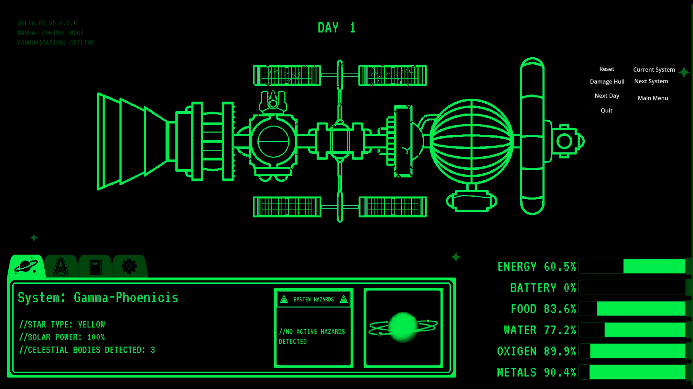
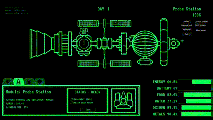

# Delta Station
A space station survival roguelite.

Aboard the Delta Station, you are left adrift with few resources to survive. Manage the diferent modules of the station, sending out probes to random planets, reparing damage to the ship and preventing it's destruction.

How long will you be able to survive?

Delta Station is currently being developed in Godot - GDScript